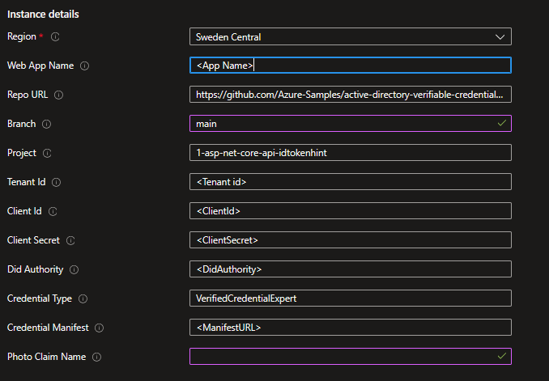

# Verified ID idTokenHint Sample for ASPNet Core

This code sample demonstrates how to use Microsoft Entra Verified ID to issue and consume verifiable credentials.

## About this sample

Welcome to Microsoft Entra Verified ID. In this sample, we'll teach you to issue your first verifiable credential: a Verified Credential Expert Card. You'll then use this card to prove to a verifier that you are a Verified Credential Expert, mastered in the art of digital credentialing. The sample uses the preview REST API which supports ID Token hints to pass a payload for the verifiable credential.

## Deploy to Azure

Complete the [setup](#Setup) before deploying to Azure so that you have all the required parameters.


[](https://portal.azure.com/#create/Microsoft.Template/uri/https%3A%2F%2Fraw.githubusercontent.com%2FAzure-Samples%2Factive-directory-verifiable-credentials-dotnet%2Fmain%2F1-asp-net-core-api-idtokenhint%2FARMTemplate%2Ftemplate.json)

You will be asked to enter some parameters during deployment about your app registration and your Verified ID details. You will find these values in the admin portal. 



The `photo` claim is for presentation to name the claim in the requested credential when asking for a `FaceCheck`. 
For issuance, the sample will use the credential manifest to determine if the credential has a photo or not. 
If you have a claim with a [type](https://learn.microsoft.com/en-us/entra/verified-id/rules-and-display-definitions-model#displayclaims-type) of `image/jpg;base64ur`, then the sample will add the selfie or uploaded photo to that claim during issuance. 

## Additional appsettings that can be used after deployment

These settings can be set in the deployed AppServices Environment Variables configuration. In AppServices, they need to have a name like `VerifiedID__PhotoClaimName`, i.e. prefixed by `VerifiedID` followed by a double underscore to match the hierarchy in the appsettingsfile.

| Key | value | Description |
|------|--------|--------|
| IssuancePinCodeLength | 0-6 | Length of pin code. A value of 0 means not to use pin code during issuance. Pin code is only supported for [idTokenHint flow](https://learn.microsoft.com/en-us/entra/verified-id/how-to-use-quickstart). If the webapp is used on a mobile device, the sample eliminates the pin code as it makes no sense. |
| useFaceCheck | true/false | If to use FaceCheck during presentation requests. This requires that the credential type asked for has a photo claim. |
| PhotoClaimName | claim name | The name of the claim in the credential type asked for during presentation when `useFaceCheck` is `true`. The PhotoClaimName is not used during issuance. If the credential manifest has a claim with a type of `image/jpg;base64ur`, that claim will hold the photo. You can override the name of the photo claim by specifying it as a query string parameter, like `/verifier?photoClaimName=photo`. |
| matchConfidenceThreshold | 50-100 | Optional. Confidence threshold for a successful FaceCheck. Default is 70 |
| CredentialExpiration | any or EOD, EOW, EOM, EOQ, EOY or ""| Optional. In [idTokenHint flow](https://learn.microsoft.com/en-us/entra/verified-id/how-to-use-quickstart) you can now set the expiration date of the issued credential. This sample illustrates this by giving you the option of setting the expiry date to a calculated value. EOW means end-of-week, EOQ end-of-quarter, etc. |

## Test Issuance and Verification

Once you have deployed this sample to Azure AppServices with a working configuration, you can issue yourself a `VerifiedCredentialExpert` credential and then test verification. 
This requires completing the [Verified ID onboarding and creation](https://learn.microsoft.com/en-us/entra/verified-id/verifiable-credentials-configure-issuer) of the `VerifiedCredentialExpert`.
If you want to test presenting and verifying other types and credentials, follow the next section.

## Test Verification via templates

The sample creates a [presentation request](https://learn.microsoft.com/en-us/entra/verified-id/get-started-request-api?tabs=http%2Cconstraints#presentation-request-example) in code based on your configuration in `appsettings.json`. 
You can also use JSON templates to create other presentation requests without changing the configuration to quickly test different scenarios. 
This github repo provides four templates for your convenience. Right-click and copy the below links, remove `http://localhost` from the link and append it to your deployed webapp so you have a URL that looks like `.../verifier?template=https://...`. 
You can issue yourself a `VerifiedEmployee` credential at [MyAccount](https://myaccound.microsoft.com) if your organization have onboarded to Verified ID and enabled MyAccount (doc [here](https://learn.microsoft.com/en-us/entra/verified-id/verifiable-credentials-configure-tenant-quick#myaccount-available-now-to-simplify-issuance-of-workplace-credentials)).

| Template | Description | Link |
|------|--------|--------|
| TrueIdentity | A presentation request for a [TrueIdentity](https://trueidentityinc.azurewebsites.net/) credential | [Link](http://localhost/verifier?template=https://raw.githubusercontent.com/Azure-Samples/active-directory-verifiable-credentials-dotnet/main/1-asp-net-core-api-idtokenhint/Templates/presentation_request_TrueIdentity.json) |
| VerifiedEmployee | A presentation request for a [VerifiedEmployee](https://learn.microsoft.com/en-us/entra/verified-id/how-to-use-quickstart-verifiedemployee) credential | [Link](http://localhost/verifier?template=https://raw.githubusercontent.com/Azure-Samples/active-directory-verifiable-credentials-dotnet/main/1-asp-net-core-api-idtokenhint/Templates/presentation_request_VerifiedEmployee.json) |
| VerifiedEmployee with FaceCheck*| A presentation request for a VerifiedEmployee credential that will perform a liveness check in the Authenticator. This requires that you have a good photo of yourself in the VerifiedEmployee credential | [Link](http://localhost/verifier?template=https://raw.githubusercontent.com/Azure-Samples/active-directory-verifiable-credentials-dotnet/main/1-asp-net-core-api-idtokenhint/Templates/presentation_request_VerifiedEmployee-FaceCheck.json) |
| VerifiedEmployee with constraints | A presentation request for a VerifiedEmployee credential that uses a claims constraints that `jobTitle` contains the word `manager` | [Link](http://localhost/verifier?template=https://raw.githubusercontent.com/Azure-Samples/active-directory-verifiable-credentials-dotnet/main/1-asp-net-core-api-idtokenhint/Templates/presentation_request_VerifiedEmployee-Constraints.json) |

*Note - FaceCheck is in preview. If you plan to test it, make sure you have the latest Microsoft Authenticator.

You can also use a local file as your template. In this case the template link will be a local file path, like `.../verifier?template=C:\Users\foobar\something\my-presentation-request.json`.

## Contents

The project is divided in 2 parts, one for issuance and one for verifying a verifiable credential. Depending on the scenario you need you can remove 1 part. To verify if your environment is completely working you can use both parts to issue a `VerifiedCredentialExpert` credential and verify that as well.

| Issuance | |
|------|--------|
| Pages/Issuer.cshtml|The basic webpage containing the javascript to call the APIs for issuance. Depending on if you use a photo, you will see options to take a selfie or upload a stock photo of you to be issued with the credential. |
| wwwroot/selfie.html|HTML page used on mobile device to take the selfie. |
| IssuerController.cs | This is the controller which contains the API called from the webpage. It calls the REST API after getting an access token through MSAL. |

| Verification | |
|------|--------|
| Pages/Verifier.cshtml | The website acting as the verifier of the verifiable credential. Depending on if you use a photo, you will have a checkbox that let's you create a presentation request with FaceCheck. |
| VerifierController.cs | This is the controller which contains the API called from the webpage. It calls the REST API after getting an access token through MSAL and helps verifying the presented verifiable credential.

| Common | |
|------|--------|
| Pages/Index.cshtml|Start page with option to continue with issuance or verification. |
| wwwroot/verifiedid.requestservice.client.js|js lib that handles all the API calls to the app |
| wwwroot/verifiedid.uihandler.js |js lib that handles common UI updates |
| CallbackController.cs | Controller that handles common functions between issuance and verification. It handles callback event from Request Service API, the polling requests from the browser and generating the selfie request. |

## Setup

Before you can run this sample make sure your environment is setup correctly, follow the instructions in the documentation [here](https://aka.ms/didfordevs).

### Create application registration

Run the [Configure.PS1](./AppCreationScripts/AppCreationScripts.md) powershell script in the AppCreationScripts directory or follow these manual steps to create an application registration and give the application the correct permissions so it can access the Verifiable Credentials Request REST API:

Register an application in Azure Active Directory:

1. Sign in to the Azure portal using either a work or school account or a personal Microsoft account.
2. Navigate to the Microsoft identity platform for developers App registrations page.
3. Select New registration
  -  In the Name section, enter a meaningful application name for your issuance and/or verification application
  - In the supported account types section, select Accounts in this organizational directory only ({tenant name})
  - Select Register to create the application
4. On the app overview page, find the Application (client) ID value and Directory (tenant) ID and record it for later.
5. From the Certificates & secrets page, in the Client secrets section, choose New client secret:
  - Type a key description (for instance app secret)
  - Select a key duration.
  - When you press the Add button, the key value will be displayed, copy and save the value in a safe location.
  - You’ll need this key later to configure the sample application. This key value will not be displayed again, nor retrievable by any other means, so record it as soon as it is visible from the Azure portal.
6. In the list of pages for the app, select API permissions
  - Click the Add a permission button
  - Search for APIs in my organization for 3db474b9-6a0c-4840-96ac-1fceb342124f or Verifiable Credential and click the “Verifiable Credential Request Service”
  - Click the “Application Permission” and expand “VerifiableCredential.Create.All”
  - Click Grant admin consent for {tenant name} on top of the API/Permission list and click YES. This allows the application to get the correct permissions


## Setting up and running the sample locally

To run the sample, clone the repository, compile & run it. Its callback endpoint must be publically reachable, and for that reason, use a tool like  `ngrok` as a reverse proxy to reach your app.

```Powershell
git clone https://github.com/Azure-Samples/active-directory-verifiable-credentials-dotnet.git
cd active-directory-verifiable-credentials-dotnet/1-asp-net-core-api-idtokenhint
```

### Create your credential

To use the sample we need a configured Verifiable Credential in the azure portal.
In the project directory CredentialFiles you will find the `VerifiedCredentialExpertDisplayDefinition.json` file and the `VerifiedCredentialExpertRulesDefinition.json` file. Use these 2 files to create your own VerifiedCredentialExpert credential. 

You can find the instructions on how to create a Verifiable Credential in the azure portal [here](https://aka.ms/didfordevs)

The `appsettings.json` needs to be updated with the following from the Verified ID portal blade:

- Copy the authority DID and set the value for `DidAuthority`. 
- Copy the credential manifest URL in the `CredentialManifest`. 
- Optionally update the CredentialType if you plan use another credential than the `VerifiedCredentialExpert` type.

The `appsettings.json` needs to be updated with the following from the Entra ID app registration portal blade:
- `ClientId` should be updated with the App registrations app id.
- `ClientSecret` should be updated with the generated client secret.
- `TenantTd` should be updated with the guid of your tenant/directory id.

## Running the sample

1. Open a command prompt and run the following command:

```Powershell
dotnet build "AspNetCoreVerifiableCredentials.csproj" -c Debug -o .\bin\Debug\net6
dotnet run
```

2. Using a different command prompt, run ngrok to set up a URL on 5000. You can install ngrok globally by using the [ngrok npm package](https://www.npmjs.com/package/ngrok/).

```Powershell
ngrok http 5000
```

3. Open the HTTPS URL generated by ngrok.

The sample dynamically copies the hostname to be part of the callback URL, this way the VC Request service can reach your sample web application to execute the callback method.

4. Select Issue Credential

5. In Authenticator, scan the QR code.

> If this is the first time you are using Verifiable Credentials the Credentials page with the Scan QR button is hidden. You can use the `add account` button. Select `other` and scan the QR code, this will enable the preview of Verifiable Credentials in Authenticator.

6. Select **Add**.

## Verify the verifiable credential by using the sample app

1. Navigate back and click on the Verify Credential link
2. Click Verify Credential button
3. Scan the QR code
4. select the VerifiedCredentialExpert credential and click allow
5. You should see the result presented on the screen.

## Best practices

When deploying applications which need client credentials and use secrets or certificates the more secure practice is to use certificates. If you are hosting your application on azure make sure you check how to deploy managed identities. This takes away the management and risks of secrets in your application.
You can find more information here:
- [Integrate a daemon app with Key Vault and MSI](https://github.com/Azure-Samples/active-directory-dotnetcore-daemon-v2/tree/master/3-Using-KeyVault)

## More information

For more information, see MSAL.NET's conceptual documentation:

- [Quickstart: Register an application with the Microsoft identity platform](https://docs.microsoft.com/azure/active-directory/develop/quickstart-register-app)
- [Quickstart: Configure a client application to access web APIs](https://docs.microsoft.com/azure/active-directory/develop/quickstart-configure-app-access-web-apis)
- [Acquiring a token for an application with client credential flows](https://aka.ms/msal-net-client-credentials)
