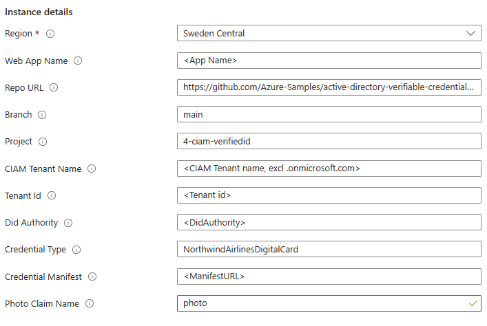

# CIAM + Verified ID sample

This sample is an ASP.Net Core sample that is designed for CIAM and Verified ID to work together. 

## Deploy to Azure

Complete the [setup](#Setup) before deploying to Azure so that you have all the required parameters.

[](https://portal.azure.com/#create/Microsoft.Template/uri/https%3A%2F%2Fraw.githubusercontent.com%2FAzure-Samples%2Factive-directory-verifiable-credentials-dotnet%2Fmain%2F4-ciam-verifiedid%2FARMTemplate%2Ftemplate.json)

You will be asked to enter some parameters during deployment about your app registration and your Verified ID details. You will find these values in the admin portal. 



## Using the sample

To use the sample, do the following:

- Open the website in your browser.
- Step 1
    - Click Sign-in, then sign-up for creating a local account
- Step 2
    - Select `Issue Verified ID` in home page
    - If you want a credential that can work with FaceCheck, either take a selfie or upload a photo of yourself
    - Click `Issue Credential` to issue yourself a credential
- Step 3
    - Sign out from the app
    - Click Sign-in, type your email, click Next and select `Use a Verified ID` to authenticate
    - Scan the QR code and present your Verified ID credential
- Step 4
    - Being signed in or not, the app can ask the user to present the Verified ID again, if required in the app 
    - Click `Present Verified ID` in the home page to create a presentation request
    - Check `Use Face Check` to request a liveness check during the presentation

## Sample configuration

This sample now has all its configuration in the [appsettings.json](appsettings.json) file and you need to update it before you run the app.
If you are running the app locally, you need to edit the appsettings.json file. If you are running the app in Azure AppServices, you need to update the
settings in an Azure AppServices deployment. You can use this template [appservice-config-template.json](appservice-config-template.json) and apply it in the Advanced Edit editor.

When deploying the app to Azure AppServices, you should use Managed Identity. This means you will have to do register an app in the Entra tenant that is the authority for the Azure subscription of the AppService.
TenantId, ClientId and ClientSecret are repeated in the VerifiedID section ***if*** you ever want to deploy the sample app to Azure AppServices and not use Managed Identity.

| Section | Setting | Description |
|------|--------|--------|
| AzureAd | Authority | Update your tenant name https://your-tenant-name.ciamlogin.com |
| | TenantId | Your CIAM tenant id (guid) |
| | TenantName | Update your tenant name your-tenant-name.onmicrosoft.com |
| | ClientId | Client Id (AppId) in the B2C tenant that is used |
| | ClientSecret | Client secret for the client id - skip if using Managed Identity |
| VerifiedID | TenantId | Your Verified ID tenant id (guid) |
| | ClientId | Client Id (AppId) in the B2C tenant that is used |
| | ClientSecret | Client secret for the client id - skip if using Managed Identity |
| | ManagedIdentity | true if you are running the app in Azure AppServices with Managed Identity. In that case, you don't need ClientId/ClientSecret/CertificateName |
| | DidAuthority | The DID of your Verified ID authority |
| | CredentialType | Name of the credential type you are using in combination with CIAM |
| | CredentialManifest | URL to the credential manifest for your Verified ID credential |
| | IssuancePinCodeLength | Enter value 4-6 if you want issuance to have a pin code. Leave 0 for no pin code |
| | useFaceCheck | If you plan to extend the sample by providing a user photo during issuance, change this flag to true |
| | PhotoClaimName | Name of photo claim |

### Setup

### Create a CIAM tenant

Use your existing CIAM tenant or follow the [quickstart]((https://learn.microsoft.com/en-us/entra/external-id/customers/quickstart-tenant-setup)) for creating a CIAM tenant. 

### Register an app and create a sign-in flow

Follow the instructions for [registering an app](https://learn.microsoft.com/en-us/entra/external-id/customers/how-to-register-ciam-app?tabs=webapp). 

Follow the instructions in the doc page with the following additions

1. Skip the permissions for claim-ToDoList-api
1. Authentication
  1. Add redirect_uris `https://localhost:5001/signin-oidc` and `https://jwt.ms/`
  1. In Implict grant and hybrid flows, select Access & ID tokens
1. Token configuration
  1. Add optional claim `email` + `preferred_username` for id & access token
1. API Permissions
  1. +Add permission > APIs my org uses > Verifiable Credentials Service Request > Application permissions > `VerifiableCredential.Create.All`
  1. Grant admin consent

The API permission is only required when running the app on localhost.

Create a sign-up and sign-in flow is documented [here](https://learn.microsoft.com/en-us/entra/external-id/customers/how-to-user-flow-sign-up-sign-in-customers).
Use the following options:

1. Identity providers: Email with password
1. User attributes: select Display Name, Given Name, Surname
1. Applications: Add Applications: Add the application you registered previously

Test run the user flow to see that it works. Select https://jwt.ms/ as Reply URL, id token as Response type

### Setup Verified ID and create a custom credential

Setup Verified ID in your tenant using the [quick setup](https://learn.microsoft.com/entra/verified-id/verifiable-credentials-configure-tenant-quick) method. Note that the Advanced setup method isn't supported. 

Create a custom credential named `NorthwindAirlinesDigitalCard` using the display and rules definitions available [here](Credential Definitions)

### Azure subscription

The sample is intended to be deployed to [Azure App Services](https://learn.microsoft.com/azure/app-service/) 
and use [Managed Identity](https://learn.microsoft.com/azure/app-service/overview-managed-identity) for authenticating and acquiring an access token to call Verified ID.
You don't need to do an app registration in Entra ID.

### Azure AppServices Managed Identity configuration

The Azure AppServices app runs using [Managed Identity](https://learn.microsoft.com/en-us/azure/app-service/overview-managed-identity) for authenticating and acquiring an access token to call Verified ID.
You don't need to do an app registration in Entra ID. You do need to grant the app the permission to call Verified ID.

1. Make sure Managed Identity is enabled for your App Service app at `Settings` > `Identity`
1. In portal.azure.com, open the `Cloud Shell` in powershell mode and run the following to grant your MSI service principal the permission to call Verified ID.

```Powershell
$TenantID="<YOUR TENANTID>"
$YourAppName="<NAME OF YOUR AZURE WEBAPP>"

#Do not change this values below
#
# Install the module
Install-Module AzureAD

Connect-AzureAD -TenantId $TenantID

$MSI = (Get-AzureADServicePrincipal -Filter "displayName eq '$YourAppName'")
Start-Sleep -Seconds 10
$ApiServicePrincipal = Get-AzureADServicePrincipal -Filter "appId eq '3db474b9-6a0c-4840-96ac-1fceb342124f'"
$AppRole = $ApiServicePrincipal.AppRoles | Where-Object {$_.Value -eq "VerifiableCredential.Create.All" -and $_.AllowedMemberTypes -contains "Application"}
New-AzureAdServiceAppRoleAssignment -ObjectId $MSI.ObjectId -PrincipalId $MSI.ObjectId ` -ResourceId $ApiServicePrincipal.ObjectId -Id $AppRole.Id
```
