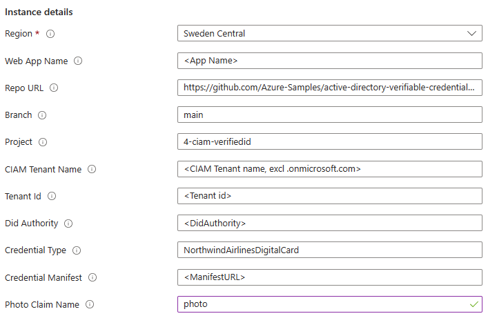

# External ID + Verified ID sample

This sample is an ASP.Net Core sample that is designed for External ID and Verified ID to work together. 

> **_NOTE:_**  The feature of signing in via presenting a Verified ID is in private preview.

## Deploy to Azure

Complete the [setup](#Setup) before deploying to Azure so that you have all the required parameters.

You will be asked to enter some parameters during deployment about your app registration and your Verified ID details. You will find these values in the admin portal. 

## Using the sample

To use the sample, do the following:

- Open the website in your browser.
- Step 1
    - Click Sign-in, then sign-up for creating a local account
- Step 2
    - Select `Issue Verified ID` in home page
    - If you want a credential that can work with FaceCheck, either take a selfie or upload a photo of yourself
    - Click `Issue Credential` to issue yourself a credential
- Step 3 (private preview)
    - Sign out from the app
    - Click Sign-in, type your email, click Next and select `Use a Verified ID` to authenticate
    - Scan the QR code and present your Verified ID credential
- Step 4
    - Being signed in or not, the app can ask the user to present the Verified ID again, if required in the app 
    - Click `Present Verified ID` in the home page to create a presentation request
    - Check `Use Face Check` to request a liveness check during the presentation

## Sample configuration

This sample now has all its configuration in the [appsettings.json](appsettings.json) file and you need to update it before you run the app.
If you are running the app locally, you need to edit the appsettings.json file. If you are running the app in Azure AppServices, you need to update the
settings in an Azure AppServices deployment. You can use this template [appservice-config-template.json](appservice-config-template.json) and apply it in the Advanced Edit editor.

| Section | Setting | Description |
|------|--------|--------|
| AzureAd | Authority | Update your tenant name https://your-tenant-name.ciamlogin.com |
| | TenantId | Your External ID tenant id (guid) |
| | TenantName | Update your tenant name your-tenant-name.onmicrosoft.com |
| | ClientId | Client Id (AppId) in the External ID tenant that is used |
| | ClientSecret | Client secret for the client id - skip if using Managed Identity |
| VerifiedID | DidAuthority | The DID of your Verified ID authority |
| | CredentialType | Name of the credential type you are using in combination with External ID |
| | CredentialManifest | URL to the credential manifest for your Verified ID credential |
| | IssuancePinCodeLength | Enter value 4-6 if you want issuance to have a pin code. Leave 0 for no pin code |
| | useFaceCheck | If you plan to extend the sample by providing a user photo during issuance, change this flag to true |
| | PhotoClaimName | Name of photo claim |

## Setup

### Create a External ID tenant

Use your existing External ID tenant or follow the [quickstart](https://learn.microsoft.com/en-us/entra/external-id/customers/quickstart-tenant-setup) for creating a External ID tenant.

### Setup Verified ID

Setup Verified ID in your tenant using the [quick setup](https://learn.microsoft.com/entra/verified-id/verifiable-credentials-configure-tenant-quick) method. Note that the Advanced setup method isn't supported. 
A requirement for using the quick setup is that you have registered a [custom domain](https://learn.microsoft.com/en-us/entra/fundamentals/add-custom-domain) for the tenant.

### Create a Verified ID custom credential

Create a custom credential named `NorthwindAirlinesDigitalCard` using the display and rules definitions available [here](Credential%20Definitions)

### Register an app

Follow the instructions for [registering an app](https://learn.microsoft.com/en-us/entra/external-id/customers/how-to-register-ciam-app?tabs=webapp) the following additions. 

1. Skip the permissions for claim-ToDoList-api
1. Authentication
    1. Add redirect_uris `https://localhost:5001/signin-oidc` and `https://jwt.ms/`
    1. In Implict grant and hybrid flows, select Access & ID tokens
1. Token configuration
    1. Add optional claim `upn` and `email` for id token
1. API Permissions
    1. +Add permission > APIs my org uses > Verifiable Credentials Service Request > Application permissions > `VerifiableCredential.Create.All`
    1. Grant admin consent

### Create a sign-in flow
Create a sign-up and sign-in flow is documented [here](https://learn.microsoft.com/en-us/entra/external-id/customers/how-to-user-flow-sign-up-sign-in-customers).
Use the following options:

1. Identity providers: Email with password
1. User attributes: select Display Name, Given Name, Surname
1. Applications: Add Applications: Add the application you registered previously

Test run the user flow to see that it works. Select https://jwt.ms/ as Reply URL, id token as Response type

### Azure subscription

The sample is intended to be deployed to [Azure App Services](https://learn.microsoft.com/azure/app-service/). You can ***not*** use [Managed Identity](https://learn.microsoft.com/azure/app-service/overview-managed-identity) for authenticating and acquiring an access token to call Verified ID.
The sample uses the ClientID and the ClientSecret configured for the External ID tenant to acquire access tokens to Verified ID.
