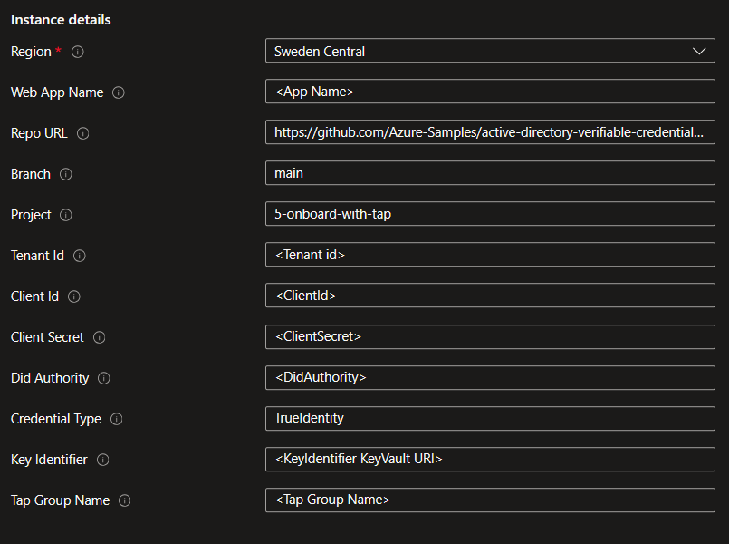
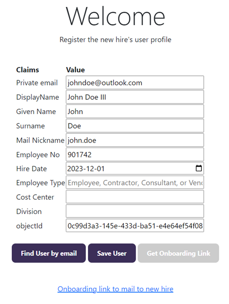
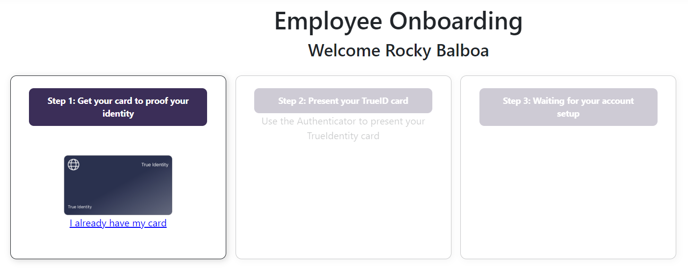
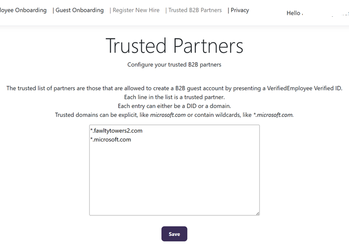
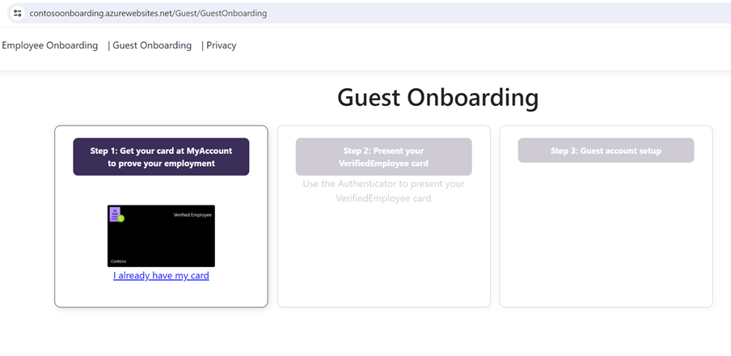

# Verified ID Code Sample for Onboarding a New Hire with Temporary Access Pass

This sample is show casing onboarding a new hire with the use of [Temporary Access Pass](https://learn.microsoft.com/en-us/entra/identity/authentication/howto-authentication-temporary-access-pass) 
to remotely gain access to their corporate account.

## About this sample

This sample supports **employee onboarding** and **guest onboarding**. 

**Employee onboarding** is the process of pre-registering a new hire and then having the new hire person getting access to the account via remote onboarding. 
The new hire can then onboard and setup their account using TrueIdentity (fictious Identity Verification Provider) and use [Temporary Access Pass](https://learn.microsoft.com/en-us/entra/identity/authentication/howto-authentication-temporary-access-pass) 
to gain access to their new account. 

**Guest onboarding** is the process of setting up a B2B Guest Account by presenting a VerifiedEmployee Verified ID credential from a trusted B2B partner. 
The user doing the guest onboarding needs to have acquired their VerifiedEmployee credential from [MyAccount](https://myaccount.microsoft.com) using their corporate credentials. 
How to enable Verified ID to be available in MyAccount is documented [here](https://learn.microsoft.com/en-us/entra/verified-id/verifiable-credentials-configure-tenant-quick#myaccount-available-now-to-simplify-issuance-of-workplace-credentials).

The sample uses [Microsoft Graph client](https://learn.microsoft.com/en-us/graph/sdks/create-client?tabs=csharp) to interact with Entra Id and create the user profile and create the TAP code, or, create the guest account invite.

## Deploy to Azure

Complete the [setup](#Setup) before deploying to Azure so that you have all the required parameters.

[](https://portal.azure.com/#create/Microsoft.Template/uri/https%3A%2F%2Fraw.githubusercontent.com%2FAzure-Samples%2Factive-directory-verifiable-credentials-dotnet%2Fmain%2F5-onboard-with-tap%2FARMTemplate%2Ftemplate.json)

You will be asked to enter some parameters during deployment about your app registration and your Verified ID details. You will find these values in the admin portal. 
What the parameter values are is explained further down in [this](#update-appsettingsjson) section.



## Using the sample

The **Employee Onboarding** scenario uses two personas:

- An admin that registers the new hire person's user profile and sends an onboarding link to the new hire person.
- A new hire person who onboards to the company and sets up their account.

The **Guest Onboarding** scenario uses two personas:

- An admin that updates the list of trusted B2B partners
- A business guest who should have a B2B guest account created

### Employee Onboarding

#### Admin

In the Employee Onboarding scenario, the admin could be a manager or HR-person. The admin signs in to the app and navigates to `Register New Hire`. 
In that page, the manager registers the details about the new user and saves the user profile for the new hire.
The `private email` will be stored in the [otherMails](https://learn.microsoft.com/en-us/graph/api/resources/user?view=graph-rest-1.0#properties) attribute in the user profile.
When saving the user profile, the user object is added to the TAP group to enable signing in via a TAP code.
The manager then clicks on `Get Onboarding Link` to generate a link that can be emailed to the new hire. The `Onboarding link to mail to new hire` contains a `mailto:` hyperlink 
that will open the managers email app with the link. For demo purposes, you can copy that link and paste it in another browser tab to bypass emailing.



#### New Hire persona

The new hire starts the journey via receiving the email with the onboarding link. The new hire should already have Microsoft Authenticator installed on their mobile device. 
That should be part of the richer instructions in the onboarding email being sent, but is excluded here.



The onboarding steps are the following:

1. Use the link in the email which takes the new hire person to the onboarding app (screenshot above).
1. Go to TrueIdentity and do identity verification for remote onboarding. This step results in a TrueIdentity Verified ID credential being issued and that the TrueIdentity websites redirect the user back to the onboarding app.
1. Present the TrueIdentity Verified ID credential to the webapp to proove the new hire's identity.
1. The onboarding app finds the user profile in Entra ID based on the TrueIdentity Verified ID credential claims that are presented. 
1. Follow instructions on how to use the new account name and the temporary access pass (TAP code) to gain initial access to the account. 
1. After new hire have gained access to their account, the onboarding app suggests next steps, which are:
    - Reset the password using Self-Service Password Reset (SSPR).
    - Upload a photo to the user profile
    - Issue a VerifiedEmployee Verified ID credential from [https://myaccount.microsoft.com](https://myaccount.microsoft.com).
    - Go to [https://myapplications.microsoft.com](https://myapplications.microsoft.com).

A few notes:
- The sample instructs the user to do this on the Authenticator, but you could in fact navigate to any page that requries authentication, like [https://myaccount.microsoft.com](https://myaccount.microsoft.com).
- Resetting the password requires [SSPR is enabled](https://learn.microsoft.com/en-us/entra/identity/authentication/tutorial-enable-sspr) for the Entra ID tenant. If the company has a [passwordless](https://support.microsoft.com/en-au/account-billing/how-to-go-passwordless-with-your-microsoft-account-674ce301-3574-4387-a93d-916751764c43) policy, this step can be skipped.
- Upload of a photo requires that the new user have access to do that. In a large company, the photo of the user is probably added by the manager/HR-person when creating the user profile.

### Guest Onboarding

#### Admin

The admin needs to sign in and updated the trusted partner list as only users from these partners are allowed to onboard as guest accounts. 
The list can containa DID or a domain name. The DID is the issuers DID of the VerifiedEmployee credential and the domain name is matched against the linked domain in the VerifiedEmployee presented.



#### Guest 

The user who should get a guest account created presents their VerifiedEmployee credential at the below page. The sample then creates a B2B guest user invitation for this user 
and asks the user to go to [MyApps](https://yapps.microsoft.com/?tenantId=...yourtenant...) to sign in to redeem the invitation.




#### Can Guest Onboarding work with another credential other than VerifiedEMployee?

Yes, it can. Which Verified ID credential type you are using is up to you as long as you trust it. The Verified ID credential needs to contain claim values for `email` and `displayName`.

If you use a different credential type, you need to update the appsettings.json file for these three entries.

```JSON
    "CredentialTypeGuest": "VerifiedEmployee",
    "GuestEmailClaimName": "mail",
    "GuestDisplayClaimName": "displayName"
```

## Contents

The project is has some parts that are common for a Verified ID ASPNet Core application and some parts that are specific for providing onboarding. 
The common parts are those that they would be in any dotnet code that interacts with Verified ID. The specific parts are thos that are specific to onboarding a user via TAP.

| Specific | Description |
|------|--------|
| [Views/Home/RegisterNewHire.cshtml](Views/Home/RegisterNewHire.cshtml) | A page that the authenticated manager/HR-representative uses to register the new hire's user account. This page is provided to make use of the sample easier. If you prefer to create the Entra Id user profile via some other process, that works too. In that case, you use this page just to generate the invitation link you email to the new hire. |
| [Views/Home/Onboarding.cshtml](Views/Home/Onboarding.cshtml) | A page that contains the onboarding journey and that requires the user to verify their identity using TrueIdentity before setting up their account. |
| [Controllers/HomeController.cs](Controllers/HomeController.cs) | Implementation that supports the above pages. |

| Common | Description |
|------|--------|
| [Controllers/VerifierController.cs](Controllers/VerifierController.cs) | Controller that creates the Verified ID presentation request for the TrueIdentity credential. |
| [Controllers/CallbackController.cs](Controllers/CallbackController.cs) | Controller that handles the [callbacks](https://learn.microsoft.com/en-us/entra/verified-id/presentation-request-api#callback-events) from Verified ID's Request Service API and that also serves status polling from the UI. |
| [Models/RequestServiceModel.cs](Models/RequestServiceModel.cs) | C# model of the [presentaiton request payload](https://learn.microsoft.com/en-us/entra/verified-id/presentation-request-api#presentation-request-payload). |
| [Helpers/KeyVaultHelper.cs](Helpers/KeyVaultHelper.cs) | Helper code to sign and validate a JWT token using a Key Vault signing key |
| [Helpers/MsalAccessTokenHelper.cs](Helpers/MsalAccessTokenHelper.cs) | Helper code to acquire an access token for Verified ID request Service API |
| [wwwroot/js/verifiedid.uihandler.js](wwwroot/js/verifiedid.uihandler.js) | Updates the browser UI and calls the below |
| [wwwroot/js/verifiedid.requestserviceclient.js](wwwroot/js/verifiedid.requestserviceclient.js) | Javascript browser component that calls the controller APIs and handles the pollign of restest status. |

## Setup

The sample uses a couple of different Azure and Entra resources, so please follow the setup instructions closely.

### Entra ID tenant

You need an Entra ID tenant to get this sample to work. You can set up a [free tenant](https://learn.microsoft.com/en-us/entra/identity-platform/quickstart-create-new-tenant) unless you don't have one already. 

### Onboard to Entra Verified ID

You need a working setup on Entra Verified ID. This is required even though you are just asking a user to present a Verified ID because the presentation request needs to come from a signed authority.
To set up Entra Verified ID, please follow the [documented tutorials](https://learn.microsoft.com/en-us/entra/verified-id/verifiable-credentials-configure-tenant-quick). There are two ways of setting up Verified ID, where one is called `Quick` and one is called `Manual`. 
In the manual setup, you have a couple of more steps to perform, like deploying an Azure Key Vault and verifying your domain, and in the quick setup you don't have to do that (given your Entra ID tenant has a verified domain already). 
You decide which model you want to follow, but please be aware that you will have to deploy or reuse an Azure Key Vault instance anyway to get this sample to work.

### Register an application in Entra ID

You need to [register](https://portal.azure.com/#view/Microsoft_AAD_IAM/ActiveDirectoryMenuBlade/~/RegisteredApps) one, possibly two applications to get this sample to work. The first application handles user sign-ins, like the manager/HR-person. 
This application also grants access to Microsoft Graph API so that the application can perform Graph API requests as required.

The second application is to gain access to Verified ID's Request Service API to be able to [create presentation requests](https://learn.microsoft.com/en-us/entra/verified-id/verifiable-credentials-configure-tenant#register-an-application-in-microsoft-entra-id). 
The second application can be the same application as the first if you want to keep it simple.

Application permissions required

| Permission | Type | Scenario | Description |
|------|--------|--------|--------|
| User.Read | Delegated |  both | So that the manager/HR-person can read their own profile |
| User.Read.All | Application | 1) | For manager/HR-person to read new hire's profile |
| User.ReadWrite.All | Application | 2) | For manager/HR-person to read/write new hire's profile |
| UserAuthenticationMethod.ReadWrite.All | Application | both | For manager/HR-personell to create the TAP code for the new hire |
| Group.ReadWrite.All | Application | 2) | For manager/HR-person to add the new hire to the TAP group |
| VerifiableCredential.Create.PresentationRequest | Application | both | For application to be able to create a Verified ID presentation request  |
| User.Invite.All | Application | Guest | For the app to have rights to create invites. Not needed if app has User.readWrite.All |

Scenarios:
1) You create the new hire user account yourself, using the management portals or other tools outside of the sample. In this case the app does not need User/Group.ReadWrite.All permissions.
2) You create the new hire user account in the sample application. In this case the app needs User/Group.ReadWrite.All permissions.

General steps for registering both of the applications:

1. Open [applications blade in Entra portal](https://entra.microsoft.com/#view/Microsoft_AAD_RegisteredApps/ApplicationsListBlade/quickStartType~/null/sourceType/Microsoft_AAD_IAM) 
2.  Select New registration
    - In the Name section, enter a meaningful application name for your issuance and/or verification application
    - In the supported account types section, select Accounts in this organizational directory only ({tenant name})
    - In the Redirect URI section, select `Web` and add `https://localhost:5001/signin-oidc`. You will later come back and add more redirect URIs.
    - Select Register to create the application
3.	On the app overview page, find the Application (client) ID value and Directory (tenant) ID and record it for later.
4.	From the Certificates & secrets page, in the Client secrets section, create a new client secret and copy it for later use in configuration as it will not be displayed again.
5.	In the list of pages for the app, select API permissions
    - Click the Add a permission button
    - Select the permissions as stated above and add them.
6.  Click Grant admin consent for {tenant name} on top of the API/Permission list and click YES. This allows the application to get the correct permissions

### Creating the UserAdmin AppRole

The admin needs to have an AppRole in order to register new hires or update the trusted partner list as these are sensitive operations that not any signed in user should be able to perform.
To create an AppRole:

1. Select `App registrations` and select the app created above.
1.  Select `App roles`
    - click `+ Create app role`
    - Enter `UserAdmin` as Display name and Value and select `Users/Groups`
    - Click Apply
1. Go to `Enterprise applications` and select the app created
1.  Select `Users and groups`
    - click `+ Add user/group` 
    - select the admin user or a group that the admin user is a member of
    - select the `UserAdmin` role (it is preselected when you only have one role)
    - click Assign

### Create a group for TAP and SSPR

1. Open [Groups](https://entra.microsoft.com/#view/Microsoft_AAD_IAM/GroupsManagementMenuBlade/~/AllGroups/menuId/AllGroups) in the Entra portal
1. Click `New group` and select Group type `Security`, Membership type `Assigned` and give the group a name.
1. Click `Create` to save the group.

### Enabling the Temporary Access Pass (TAP)

1.  Open [Authentication Methods](https://entra.microsoft.com/#view/Microsoft_AAD_IAM/AuthenticationMethodsMenuBlade/~/AdminAuthMethods/fromNav/) in Entra portal.
1.  Click on `Temporary Access Pass`, enable it and select the `target group` created in the above step.
1.  Click on Configure, then `Edit` and change the `Minumum lifetime` to 15 minutes  
1.  Click `Save`  

### Enabling Self-Service Password Reset

This step is only required if you want to change the new hire's password as part of the onboarding.

1.  Open [Password reset](https://entra.microsoft.com/#view/Microsoft_AAD_IAM/PasswordResetMenuBlade/~/Properties/fromNav/Identity) in Entra portal.
1.  Click on `Selected`, and select the same `target group` you selected for TAP codes.
1.  Click `Save`  

### Deploying Azure Key Vault 

The sample creates a link that is sent to the new hire's private email. The link containes a JWT token signed with an Azure Key Vault key. 
The token is used as proof upon starting the onboarding process (only the new hire has the token) and is also passed to and returned from TrueIdentity for the same reason.
If you have set up Verified ID the manual way, you already have an Azure Key Vault and can reuse it. 

**To create a new Key Vault instance:**
1. Open [Key Vault](https://portal.azure.com/#view/HubsExtension/BrowseResource/resourceType/Microsoft.KeyVault%2Fvaults) in the Azure portal.
1. Click `Create`
1. Select or create a resource group
1. Give the Key Vault instance a name, the region you usually use and keep the pricing tier as `Standard`.
1. Click `Create`.

**To update Access policies for Verified ID:**
1. For verified ID setup, you can follow [these](https://learn.microsoft.com/en-us/entra/verified-id/verifiable-credentials-configure-tenant#create-a-key-vault) instruction for key permissions needed. 

**To add the sample application's permission:**
1. In `Access policies`, click `Create`
1. Select `Get, Sign` key permissions.
1. Select your app, created above
1. Click `Next` and `Create`

**To generate a new signing key:**
1. In `Keys`, click `Generate/Import`
1. Give the key a name, select type `RSA` and size `2048`
1. Click `Create`
1. Open up the created key and copy `Key Identifier` URI from the properties.

## Setting up and running the sample

### Cloning the sample

```Powershell
git clone https://github.com/Azure-Samples/active-directory-verifiable-credentials-dotnet.git
cd active-directory-verifiable-credentials-dotnet/5-onboard-with-tap
```

### Update appsettings.json

The appsettings.json file have the following settings that needs to be updated. The default values for the settings not listed doesn't need to be changed just to get the sample running. 

| Section | Name | Value | Note |
|------|--------|--------|--------|
| AppSettings | KeyIdentifier | URI | Key Identifier URI of your deployed Azure Key Vault signing key | 
| AzureAd | Instance | https://login.microsoftonline.com/ | you don't need to chnge this value unless you don't run in the global Azure cloud |
| | TenantId | guid | Your tenant id (guid) |
| | ClientId| guid | AppID (client_id) |
| | ClientSecret | string | The client secret generated in the portal |
| | TapGroupName | group-name | Name of the group used when enabling TAP and SSPR |
| VerifiedID | TenantId | guid | Your tenant id (guid) can be same or different as the AzureAd.TenantId. If it is the same, you can leave this setting blank ("") and the sample will use AzureAd.TenantId. |
| | ClientId| guid | Your AppID (client_id) can be same or different as the AzureAd.ClientId. If it is the same, you can leave this setting blank ("") and the sample will use AzureAd.ClientId. |
| | ClientSecret | string | Your client secret can be same or different as the AzureAd.ClientSecret. If it is the same, you can leave this setting blank ("") and the sample will use AzureAd.ClientSecret. |
| | DidAuthority | did | The authority DID that is making the presentation request. You can copy it from your [Organizational settings](https://portal.azure.com/#view/Microsoft_AAD_DecentralizedIdentity/InitialMenuBlade/~/issuerSettingsBlade) in the Entra portal |

If you are deploying the solution to Azure AppServices, the configuration settings needs to have names like `AppSettings__KeyIdentifier`, `AzureAd__ClientId` and `VerifiedId__DidAuthority`, 
ie Section, then double underscore, followed by name.

## Setting up and run the sample locally

1. Clone the github repo
```Powershell
git clone https://github.com/Azure-Samples/active-directory-verifiable-credentials-dotnet.git
cd active-directory-verifiable-credentials-dotnet/4-asp-net-core-api-verify-and-onboard
```
2. Update the appsettings.json file as explained in the above section.
3. Compile & run it using either Visual Studio or VSCode.
```Powershell
dotnet build "OnboardWithTAP.csproj" -c Debug -o .\bin\Debug\net6
dotnet run
```
4. Install [ngrok](https://ngrok.com/download) tool if you don't have it already.
5. Start ngrok
```Powershell
ngrok http 5000
```
6. Copy ngrok's `https` forwarding URL:
    - Update your app's `Redirect URI` to also have `https://56aa-367-420-597-13.ngrok-free.app/signin-oidc` (replace with your ngrok URL).
    - Browse to `https://56aa-367-420-597-13.ngrok-free.app` to use the app.

## Deploy sample to Azure AppServices

The `Deploy to Azure` button above deploys the sample to Azure AppServices using an ARM template directly. 
The template asks for parameters which is the equivalent of updating the appsettings.json file.
If all settings are correct, the app should launch and be ready for use. However, after deployment, you have to update the app registration so that user sign in will work.

Update your app's `Redirect URI` to also have `https://your-name.azurewebsites.net/signin-oidc` (replace with your name).

## More information

For more information, see MSAL.NET's conceptual documentation:

- [Quickstart: Register an application with the Microsoft identity platform](https://docs.microsoft.com/azure/active-directory/develop/quickstart-register-app)
- [Quickstart: Configure a client application to access web APIs](https://docs.microsoft.com/azure/active-directory/develop/quickstart-configure-app-access-web-apis)
- [Acquiring a token for an application with client credential flows](https://aka.ms/msal-net-client-credentials)
