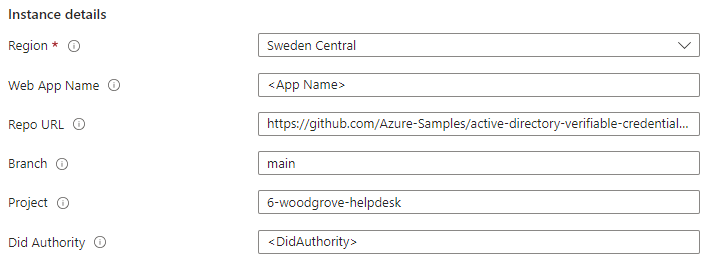

# Verified ID Code Sample for Woodgrove Helpdesk

This sample is show casing identifying yourself at a helpdesk by presenting your [VerifiedEmployee](https://learn.microsoft.com/en-us/entra/verified-id/how-to-use-quickstart-verifiedemployee) card.
The helpdesk websites require a Face Check together with the presentation for high assurance that the person is who they claim to be before getting support. 
More info about this pattern can be found [here](https://learn.microsoft.com/en-us/entra/verified-id/helpdesk-with-verified-id).

**Note** - it is a demo app and not a real helpdesk portal.

## Deploy to Azure

Complete the [setup](#Setup) before deploying to Azure so that you have all the required parameters.

[](https://portal.azure.com/#create/Microsoft.Template/uri/https%3A%2F%2Fraw.githubusercontent.com%2FAzure-Samples%2Factive-directory-verifiable-credentials-dotnet%2Fmain%2F6-woodgrove-helpdesk%2FARMTemplate%2Ftemplate.json)

You need to enter the following parameters:

1. The app name. This needs to be globally unique as it will be part of your URL, like https://your-app-name.azurewebsites.net/
1. Your DID for your Entra Verified ID authority. After setting up Verified ID, you find your DID [here](https://portal.azure.com/#view/Microsoft_AAD_DecentralizedIdentity/InitialMenuBlade/~/issuerSettingsBlade)



## Using the sample

To use the sample, do the following:

- Open the website in your browser.
- Step 1
    - Either click the step 1 button to go to [MyAccount](https://myaccount.microsoft.com) and issue yourself a VerifiedEmployee credential from your company, or click `I already have my card` to advance to step 2.
- Step 2
    - Scan the QR code with your Microsoft Authenticator
    - Select your VerifiedEmployee card
    - Perform the Face Check on your mobile
    - Share the credential and the liveness result
- Step 3
    - In final step, your email and displayName will show together with your face check score.
    - The webapp says "a support personnel will be you shortly", but don't wait for too long as this is just a sample....

## Using the sample on a mobile phone

Follow the steps above, with the additions.

- Launch the website in your mobile browser.
- When clicking on the `I already have my card`, you will be asked to open the Microsoft Authenticator and you have to accept that.
- After sharing the credential and the Face Check result in the Microsoft Authenticator, manually return to your mobile browser app
- Click `Continue` in the middle section

## Extending the sample with Microsoft Teams

The sample is prepared to send a message to a Microsoft Teams channel using a [webhook](https://learn.microsoft.com/en-us/microsoftteams/platform/webhooks-and-connectors/what-are-webhooks-and-connectors). 
In order to extend the sample, create an [incoming webhook](https://learn.microsoft.com/en-us/microsoftteams/platform/webhooks-and-connectors/how-to/add-incoming-webhook?tabs=newteams%2Cdotnet) and update the app's configuration in your Azure AppService's configuration:

| Key | Value |
|------|--------|
| AppSettings__UseTeamsWebhook | "true" |
| AppSettings__TeamsWebhookURL | URL of the incoming webhook |

## Setup

### Entra ID tenant

You need an Entra ID tenant to get this sample to work. You can set up a [free tenant](https://learn.microsoft.com/en-us/entra/identity-platform/quickstart-create-new-tenant) unless you don't have one already. 

### Setup Verified ID

[Setup Verified ID](https://learn.microsoft.com/en-us/entra/verified-id/verifiable-credentials-configure-tenant-quick) in your tenant and enable MyAccount. 
You do not need to register an app or create a custom Verified ID credential schema.

### Azure subscription

The sample is intended to be deployed to [Azure App Services](https://learn.microsoft.com/en-us/azure/app-service/) 
and use [Managed Identity](https://learn.microsoft.com/en-us/azure/app-service/overview-managed-identity) for authenticating and acquiring an access token to call Verified ID.
You don't need to do an app registration in Entra ID.

### Configuring Managed Identity

1. Enable Managed Identity for your App Service app at `Settings` > `Identity`
1. In portal.azure.com, open the `Cloud Shell` in powershell mode and run the following to grant your MSI service principal the permission to call Verified ID.

```Powershell
$TenantID="<YOUR TENANTID>"
$YourAppName="<NAME OF YOUR AZURE WEBAPP>"

#Do not change this values below
#
$ApiAppId = "3db474b9-6a0c-4840-96ac-1fceb342124f"
$PermissionName = "VerifiableCredential.Create.PresentRequest"
 
# Install the module
Install-Module AzureAD

Connect-AzureAD -TenantId $TenantID

$MSI = (Get-AzureADServicePrincipal -Filter "displayName eq '$YourAppName'")

Start-Sleep -Seconds 10

$ApiServicePrincipal = Get-AzureADServicePrincipal -Filter "appId eq '$ApiAppId'"
$AppRole = $ApiServicePrincipal.AppRoles | Where-Object {$_.Value -eq $PermissionName -and $_.AllowedMemberTypes -contains "Application"}
New-AzureAdServiceAppRoleAssignment -ObjectId $MSI.ObjectId -PrincipalId $MSI.ObjectId ` -ResourceId $ApiServicePrincipal.ObjectId -Id $AppRole.Id
```

## Troubleshooting

If you are deploying this sample to Azure App Services, then you can view app logging information in the `Log stream` if you do the following:

- Go to Development Tools, then Extensions
- Select `+ Add` and add `ASP.NET Core Logging Integration` extension
- Go to `Log stream` and set `Log level` drop down filter to `verbose`

The Log stream console will now contain traces from the deployed. Don't forget do disable extension when troubleshooting is done.

